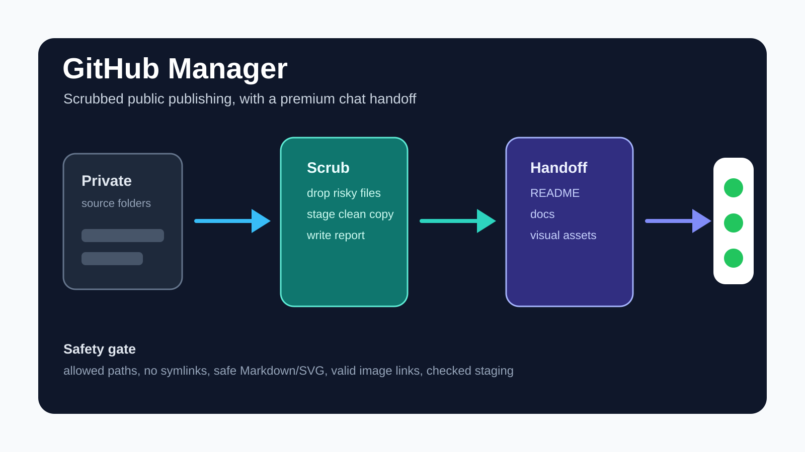

# GitHub Manager



GitHub Manager is a local, agent-guided publishing tool for turning private working folders into clean public GitHub repositories. It scans local projects, prepares scrubbed staging copies, checks them for risky content, and syncs only the approved public output.

## What It Does

- Finds coding projects under a chosen documents root.
- Matches already published public repositories where possible.
- Updates existing private source repositories before preparing public copies.
- Builds sanitized public staging folders without editing original project folders.
- Drops blocked files when configured to do so.
- Writes readable reports for every run.
- Offers a chat handoff mode so the current chat can create polished public READMEs, docs, and visual assets before sync.

## Highlights

- **Private stays private:** original source folders are not modified during public staging.
- **Scrubbed staging first:** public repos are synced from checked staging folders, not directly from working trees.
- **Human-readable reports:** each run explains what changed, what was skipped, and why.
- **Premium handoff path:** the current chat can draft `README.md`, `docs/**/*.md`, and safe visual assets under `docs/assets/`.
- **Safety gate remains in the manager:** draft files are accepted only after path, link, symlink, markdown, SVG, and file-safety checks pass.

## Quick Start

Scan local projects:

```bash
python3 -m github_manager scan
```

Preview a managed run:

```bash
python3 -m github_manager run --dry-run --non-interactive
```

Prepare public scrubbed counterparts:

```bash
python3 -m github_manager run --drop-blocked-files --sanitized-counterparts --public-only
```

Pause for premium README and asset drafts:

```bash
python3 -m github_manager run --drop-blocked-files --sanitized-counterparts --public-only --chat-handoff
```

## Project Map

| Path | Purpose |
| --- | --- |
| `github_manager/cli.py` | Command-line entrypoint and options |
| `github_manager/runner.py` | Project scan, staging, handoff, safety, and sync flow |
| `github_manager/safety.py` | Public-copy safety checks |
| `github_manager/reporting.py` | Run report rendering |
| `tests/` | Unit tests for the manager behavior |

## Chat Handoff

Handoff mode prepares scrubbed staging first, then prints a handoff folder for the current chat. Drafts are accepted only from each project draft folder and only at these public-safe paths:

- `README.md`
- `docs/**/*.md`
- `docs/assets/**/*.{png,jpg,jpeg,webp,svg}`

If no completion marker appears before timeout, the manager continues with scrubbed staging as-is. If drafts are present but invalid, that project's drafts are rejected and the existing scrubbed staging continues.

## Testing

Run the full suite:

```bash
python3 -m unittest discover -v
```

Run a syntax check:

```bash
python3 -m compileall -q github_manager tests
```

## Public Publishing Policy

GitHub Manager keeps source projects and public repositories separate. A native Git remote may identify the private source, while the public repository is a cleaned copy staged under `.github-manager/staging` and checked before sync.

